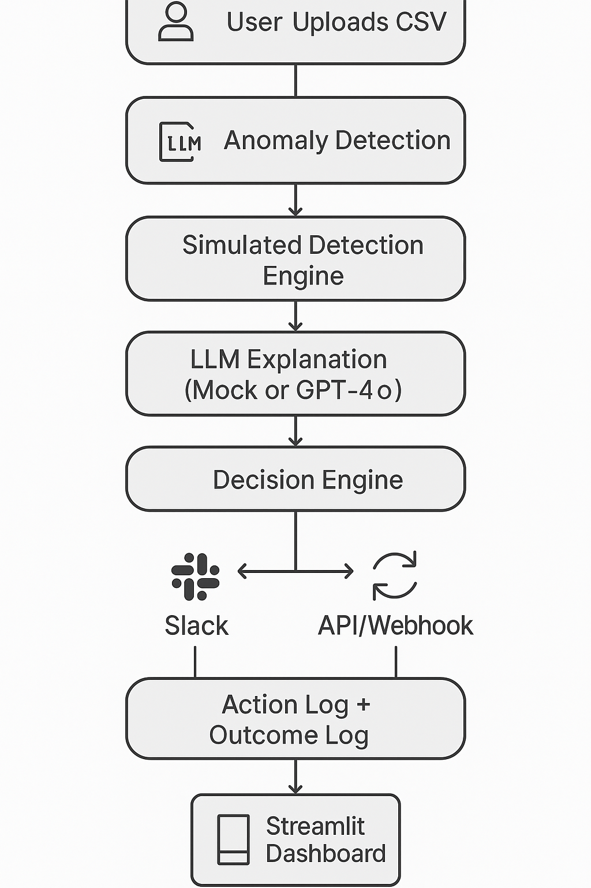

# liveops-agent
Real-time AI agent for operational decision-making
# 🤖 LiveOps Agent

AI-powered real-time co-pilot for operations teams.  
It detects anomalies, explains root causes, simulates actions, and learns from outcomes — all in a beautiful dashboard.

---

## 🧠 What It Does

| Feature             | Description                                                     |
|---------------------|-----------------------------------------------------------------|
| ⚡ Event Ingestion   | Simulates real-time order, revenue, and inventory data         |
| 🔍 Anomaly Detection | Detects spikes/drops using Z-score logic                      |
| 🧠 LLM Reasoning     | (Mocked) natural explanations of anomalies                     |
| 🛠️ Decision Engine  | Suggests actions (reroute, boost ads, flag for audit)          |
| 📤 Action Layer      | Sends Slack alerts, simulates API postbacks                   |
| 🧾 Memory            | Logs anomalies + actions in CSV                                |
| 🌀 Feedback Loop     | Tracks if actions were effective (pending, success, failed)   |
| 📊 Analytics         | Charts performance in Streamlit UI                             |
| 🔁 Autonomous Loop   | Runs every 10 seconds in the background                        |

---

## 🖼️ Architecture



---

## 📸 UI Preview


---

## 🚀 How to Run Locally

```bash
git clone https://github.com/your-username/liveops-agent.git
cd liveops-agent
python3 -m venv venv
source venv/bin/activate

pip install -r requirements.txt
python data/simulate_stream.py   # In one terminal
python auto_agent.py             # In another
streamlit run ui/dashboard.py    # In browser
