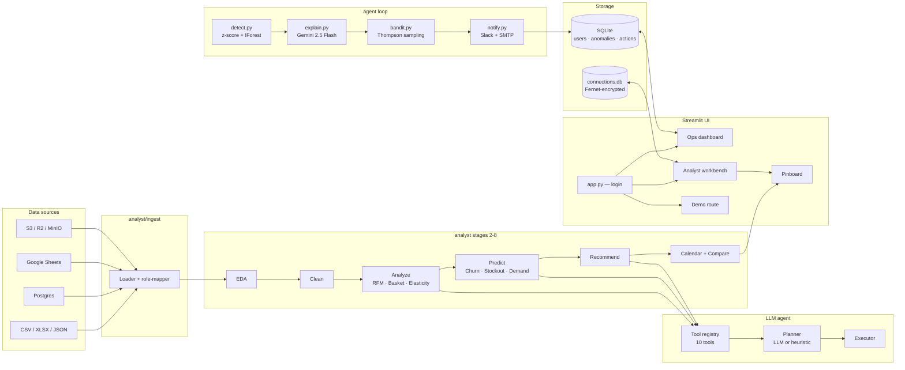

# LiveOps Agent

[](https://github.com/sathwikarr/liveops-agent/actions/workflows/tests.yml)
[](https://github.com/sathwikarr/liveops-agent/actions/workflows/deploy.yml)
[](pyproject.toml)
[](LICENSE)

> **An AI co-pilot for retail/ecommerce ops.** Watches your live order stream, catches
> anomalies the dashboard would miss, asks an LLM *why*, picks a mitigating action with
> a Thompson-sampling bandit, and routes severity-gated alerts to Slack + email — and
> ships with a 9-stage **Analyst Workbench** that turns a CSV into RFM segments,
> elasticity curves, churn predictions, and a recommendation calendar in two clicks.

---

## ✨ Try it in 30 seconds

```bash
git clone https://github.com/sathwikarr/liveops-agent.git
cd liveops-agent
docker build -t liveops-agent .
docker run --rm -p 8000:8000 liveops-agent
# → open http://localhost:8000 — landing page, then /demo, /workbench, /evals (no signup needed)
```

The **Demo** page auto-loads a bundled retail dataset (3,878 orders × 30 SKUs ×
200 customers) and walks you through every stage of the analyst pipeline with
interactive Plotly charts. No API keys, no data setup, no friction.

---

## What's in the box

The repo ships **two** complementary products that share auth, DB, and notifications:

### 🔴 Ops vertical — real-time anomaly response

| Layer            | What it does                                                                          |
|------------------|---------------------------------------------------------------------------------------|
| Detection        | Per-(region, product) z-score + IsolationForest on revenue, orders, inventory         |
| Explanation      | Gemini 2.5 Flash → structured JSON (cause, severity, action, bullets)                 |
| Decision         | Thompson-sampling bandit picks the next action; learns from logged outcomes           |
| Notifications    | Unified Slack + SMTP, severity-gated, deduped on a sliding cooldown                   |
| Memory           | SQLite (WAL) — `users`, `anomalies`, `actions`                                        |
| Forecasting      | Prophet per-segment + adaptive resample + walk-forward CV (MAPE / SMAPE / RMSE)       |
| Auth             | bcrypt signup + login, scoped per-user data                                           |
| Runners          | FastAPI website (`web.server:app`) + standalone CLI loop (`auto_agent.py`)            |

### 🟣 Analyst Workbench — exploratory data product (9 stages)

| Stage | Page section            | Capability                                                                |
|-------|-------------------------|---------------------------------------------------------------------------|
| 1     | Ingest                  | Schema-agnostic upload (CSV/XLSX/JSON/Parquet), auto role-mapping         |
| 2     | EDA                     | Distributions, correlations, seasonality detection                        |
| 3     | Clean                   | Suggested fixes (dedupe, imputation, type coercion) with audit log        |
| 4     | Analyze                 | RFM, cohorts, market basket (Apriori), price elasticity                   |
| 5     | Predict                 | Churn (logistic), stockout risk, demand forecast                          |
| 6     | Recommend               | Insight-driven action ranking with confidence + ROI estimates             |
| 7     | NL Query + What-if      | Ask the data anything; what-if simulator; 1-click narrative report        |
| 8     | Calendar + Compare      | Action calendar (Plotly Gantt), multi-dataset join, competitor benchmark  |
| 🤖    | Agent (tool-using)      | LLM **or** offline heuristic agent that picks tools and explains its plan |
| 📌    | Pinboard                | Pin any chart, persist as JSON, export a standalone HTML report           |

### 🔌 Live data connectors

Beyond file upload, the workbench can pull from:

- **Postgres / Redshift / any SQLAlchemy URL** — raw SQL or `SELECT * FROM table LIMIT N`
- **Google Sheets** — service-account auth or public CSV-export fallback
- **S3 / R2 / MinIO** — CSV / Parquet / JSON, format auto-detected from extension
- **Local files** — same picker, just unified

Saved connections live in a **SQLite-backed store with Fernet-encrypted secrets**
(`ANALYST_CONN_KEY` env var, or a 0600-perm file under `~/`).

---

## Architecture


```mermaid
flowchart LR
    subgraph Sources["Data sources"]
        S1[CSV / XLSX / JSON]
        S2[Postgres]
        S3[Google Sheets]
        S4[S3 / R2 / MinIO]
    end

    subgraph Ingest["analyst/ingest"]
        IN[Loader + role-mapper]
    end

    subgraph Stages["analyst stages 2-8"]
        E[EDA]
        C[Clean]
        A[Analyze<br/>RFM · Basket · Elasticity]
        P[Predict<br/>Churn · Stockout · Demand]
        R[Recommend]
        K[Calendar + Compare]
    end

    subgraph Agent["agent loop"]
        DET[detect.py<br/>z-score + IForest]
        EXP[explain.py<br/>Gemini 2.5 Flash]
        BAN[bandit.py<br/>Thompson sampling]
        NOT[notify.py<br/>Slack + SMTP]
    end

    subgraph LLM["LLM agent"]
        TR[Tool registry<br/>10 tools]
        PL[Planner<br/>LLM or heuristic]
        EX[Executor]
    end

    subgraph Storage["Storage"]
        DB[(SQLite<br/>users · anomalies · actions)]
        CS[(connections.db<br/>Fernet-encrypted)]
    end

    subgraph UI["Streamlit UI"]
        APP[app.py — login]
        DASH[Ops dashboard]
        WB[Analyst workbench]
        DEMO[Demo route]
        PIN[Pinboard]
    end

    S1 & S2 & S3 & S4 --> IN --> E --> C --> A --> P --> R --> K
    K --> PIN
    DET --> EXP --> BAN --> NOT --> DB
    A & P & R --> TR --> PL --> EX
    APP --> DASH & WB & DEMO
    DB <--> DASH
    CS <--> WB
    WB --> PIN
```

---

## Layout

```
agent/                       # Real-time ops loop
  auth.py        bcrypt signup + login
  bandit.py      Thompson-sampling action picker
  db.py          SQLite layer (init, users, anomalies, actions)
  detect.py      per-segment z-score + IsolationForest
  explain.py     Gemini structured-output wrapper (deterministic fallback)
  forecast.py    Prophet per-segment forecasts + backtests
  notify.py      Slack + SMTP unified notifier with severity routing
  action.py      simulate_action — bandit pick + Gemini severity + notify + log

analyst/                     # Analyst workbench
  ingest.py      schema-agnostic loader + dataset classifier
  eda.py         distributions, correlations, seasonality
  clean.py       cleaning suggestions + audit log
  analysis.py    RFM, cohorts, market basket, elasticity
  predict.py     churn, stockout, demand
  recommend.py   insight-driven action ranking
  charts.py      8 Plotly chart builders (used by workbench + demo + pinboard)
  pinboard.py    pin specs, persistence, standalone HTML export
  agent.py       LLM tool-using loop with heuristic fallback
  connectors/    postgres / gsheets / s3 / file + Fernet-encrypted store

pages/
  dashboard.py            Ops dashboard (anomalies, actions, forecasts)
  analyst_workbench.py    9-stage analyst UI
  demo.py                 auto-loaded sample-data walkthrough
  run_agent.py            canonical pipeline runner — used by dashboard + CLI

app.py                     login / signup entry page
auto_agent.py              standalone CLI: poll → detect → explain → act → alert

tests/                     226 pytest tests
.github/workflows/         tests.yml (3.11 + 3.12) · deploy.yml (GHCR + Fly)
Dockerfile                 multi-stage build, non-root runtime, healthcheck
fly.toml                   one-click Fly.io deployment config
```

---

## Quick start (no Docker)

```bash
git clone https://github.com/sathwikarr/liveops-agent.git
cd liveops-agent
python3 -m venv venv && source venv/bin/activate
pip install -r requirements.txt
cp .env.example .env             # fill in GEMINI_API_KEY (optional)
uvicorn web.server:app --reload  # → http://127.0.0.1:8000
```

Open the landing page, then jump to whichever surface fits — no signup required for the public ones:

- **/demo** — bundled retail dataset, KPIs + first 8 rows, recomputed each load.
- **/workbench** — ask the agent in plain English; watch it pick tools and run them.
- **/evals** — fire the 55-case eval harness, baseline-pinned and regression-checked.
- **/dashboard** + **/run-agent** — auth-gated ops vertical (sign up at /signup).

To run the headless ops loop:

```bash
python auto_agent.py --user smoketest --interval 60 --threshold 2.0
python auto_agent.py --user smoketest --once          # one-shot
```

---

## Configuration (.env)

See `.env.example` for the full list. Most are optional — the app degrades gracefully.

| Variable                    | Purpose                                                            |
|-----------------------------|--------------------------------------------------------------------|
| `GEMINI_API_KEY`            | LLM explanations + LLM agent backend (heuristic backend works without it) |
| `GEMINI_MODEL`              | Defaults to `gemini-2.5-flash`                                     |
| `SLACK_WEBHOOK`             | Optional — leave blank to disable Slack                            |
| `SMTP_HOST`, `SMTP_USER`, … | Optional — leave `SMTP_HOST` blank to disable email                |
| `ALERT_SLACK_MIN_SEVERITY`  | `low` / `medium` / `high` / `critical`                             |
| `ALERT_EMAIL_MIN_SEVERITY`  | `low` / `medium` / `high` / `critical`                             |
| `ANALYST_CONN_KEY`          | Fernet key for the saved-connection store (auto-generated if absent) |

---

## Tests

**268 pytest tests** cover auth, DB, dedupe, detect (z-score + IForest), forecast,
bandit, notify, every analyst stage, the LLM agent loop, connectors, charts, the
pinboard, the 55-case eval harness, and the FastAPI routes (signup→login→dashboard,
JSON APIs, anonymous redirects). CI runs on Python 3.11 + 3.12 — see `.github/workflows/tests.yml`.

```bash
pip install pytest
SLACK_WEBHOOK="" SMTP_HOST="" GEMINI_API_KEY="" pytest -v
```

---

## Deployment

### Docker (local)

```bash
docker build -t liveops-agent .                       # multi-stage, non-root
docker run --rm -p 8000:8000 \
  --env-file .env \
  -v "$PWD/data:/app/data" \
  liveops-agent
```

### Fly.io (production-grade, one-shot)

```bash
fly launch --no-deploy --copy-config
fly volume create liveops_data --region iad --size 1
fly secrets set \
  GEMINI_API_KEY=... \
  ANALYST_CONN_KEY=$(python -c "from cryptography.fernet import Fernet; print(Fernet.generate_key().decode())")
fly deploy
```

### GitHub Actions (CI/CD)

`tests.yml` runs the full pytest matrix on every PR. `deploy.yml` builds + pushes
the image to **GitHub Container Registry** on every `v*.*.*` tag, then deploys to
Fly if `FLY_API_TOKEN` is configured.

```bash
git tag v0.1.0 && git push --tags          # triggers build + deploy
```

### macOS launchd (background loop)

`deploy/com.liveops.agent.plist` runs the headless `auto_agent.py` loop on
boot; start the dashboard separately when you want to look at it.

---

## Security

`/.env` and `streamlit/secrets.toml` are git-ignored. Connector secrets are
**Fernet-encrypted at rest** in `connections.db`; rotating `ANALYST_CONN_KEY`
blanks out only the encrypted fields and leaves plaintext config intact, so
users only have to re-enter passwords.

If a secret leaks into git history, see `SECURITY.md` for the rotation playbook.

---

## License

MIT — see [LICENSE](LICENSE).
