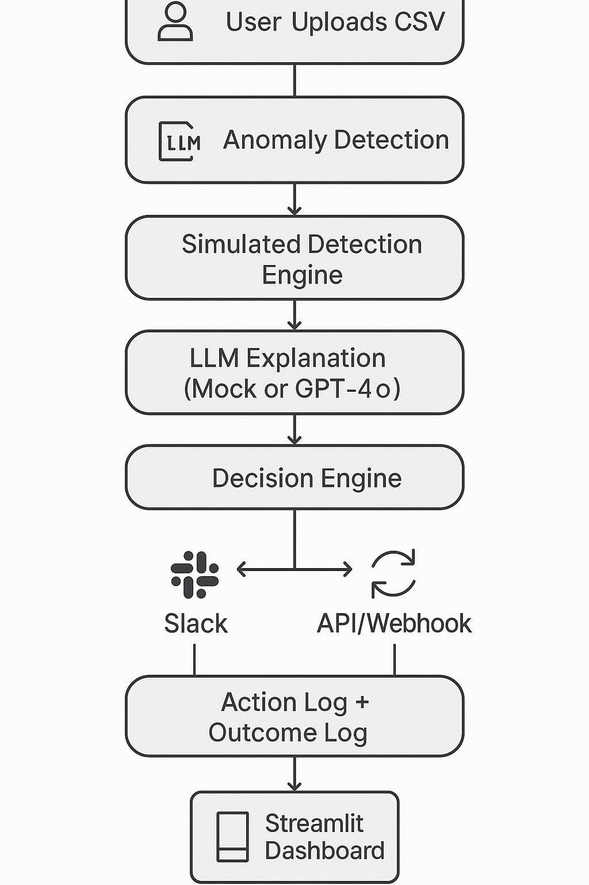

# LiveOps Agent

[](https://github.com/sathwikarr/liveops-agent/actions/workflows/tests.yml)

Real-time AI co-pilot for operations teams. Watches a revenue/orders/inventory
stream, surfaces anomalies, asks Gemini for a structured root-cause analysis,
picks the best mitigating action via a Thompson-sampling bandit, sends
severity-routed Slack + email alerts, and forecasts each (region, product)
segment with Prophet — all in a Streamlit dashboard backed by SQLite.

---

## What's in the box

| Layer            | What it does                                                                   |
|------------------|--------------------------------------------------------------------------------|
| Detection        | Per-(region, product) z-score + IsolationForest (auto) on revenue, orders, inventory |
| Explanation      | Gemini 2.5 Flash returning structured JSON: cause, severity, action, bullets  |
| Decision         | Thompson-sampling bandit over candidate actions, learns from logged outcomes  |
| Notifications    | Unified Slack webhook + SMTP email, severity-gated, deduped on a sliding cooldown |
| Memory           | SQLite (WAL) — `users`, `anomalies`, `actions` — with one-time CSV migration  |
| Forecasting      | Prophet per-segment + adaptive resample freq + walk-forward CV (MAPE / SMAPE / RMSE) |
| Auth             | bcrypt signup + login, scoped per-user data                                     |
| Runners          | Streamlit dashboard (`app.py`) + standalone CLI loop (`auto_agent.py`)         |

---

## Layout

```
agent/
  auth.py        bcrypt signup + login
  bandit.py      Thompson sampling action picker
  db.py          SQLite layer (init, users, anomalies, actions)
  detect.py      per-segment + global z-score anomaly detection
  explain.py     Gemini structured-output wrapper (with deterministic fallback)
  forecast.py    Prophet per-segment forecasts + backtests
  memory.py      thin wrapper exposing log paths
  notify.py      Slack + SMTP unified notifier with severity routing
  action.py      simulate_action — bandit pick + Gemini severity + notify + log
  utils.py       with_backoff retry helper
pages/
  dashboard.py   the Streamlit dashboard (anomalies, actions, forecasts)
  run_agent.py   the canonical pipeline runner — used by dashboard + CLI
app.py           login / signup entry page
auto_agent.py    standalone CLI: poll on an interval, run pipeline, alert
data/            SQLite DB + simulator (gitignored)
user_data/       per-user uploaded CSVs (gitignored)
```

---

## Quick start

```bash
git clone https://github.com/sathwikarr/liveops-agent.git
cd liveops-agent

python3 -m venv venv
source venv/bin/activate
pip install -r requirements.txt

cp .env.example .env
# Fill in GEMINI_API_KEY (required), SLACK_WEBHOOK + SMTP_* (optional)

streamlit run app.py
```

Then in your browser at http://localhost:8501:
1. Sign up + log in.
2. Upload a CSV with `timestamp, region, product_id, orders, inventory, revenue` columns.
3. Click "Run Agent Once" — anomalies, actions, and forecasts populate.

To run the CLI loop (no UI) instead:
```bash
python auto_agent.py --user smoketest --interval 60 --threshold 2.0
python auto_agent.py --user smoketest --once          # one-shot
```

---

## Configuration (.env)

See `.env.example` for the full list. The important ones:

| Variable                    | Purpose                                            |
|-----------------------------|----------------------------------------------------|
| `GEMINI_API_KEY`            | Required for real LLM explanations                  |
| `GEMINI_MODEL`              | Defaults to `gemini-2.5-flash`                      |
| `SLACK_WEBHOOK`             | Optional — leave blank to disable Slack            |
| `SMTP_HOST`, `SMTP_USER`, … | Optional — leave `SMTP_HOST` blank to disable email |
| `ALERT_SLACK_MIN_SEVERITY`  | `low` / `medium` / `high` / `critical`              |
| `ALERT_EMAIL_MIN_SEVERITY`  | `low` / `medium` / `high` / `critical`              |

If `GEMINI_API_KEY` is unset, `explain.py` falls back to a deterministic stub
so the rest of the pipeline still works in tests / CI.

---

## Tests

53 pytest tests cover auth, db, dedupe, detect (z-score + IsolationForest),
forecast, bandit, and notify. CI runs them on Python 3.11 + 3.12 — see
`.github/workflows/tests.yml`.

```bash
pip install pytest
SLACK_WEBHOOK="" SMTP_HOST="" GEMINI_API_KEY="" pytest -v
```

---

## Deployment

Three options — see `deploy/README.md`:

- **Docker Compose** (recommended) — `docker compose up --build` runs the
  dashboard + auto-agent loop, both sharing a SQLite volume.
- **Single Docker container** — `docker build -t liveops-agent .` then run
  either `streamlit run app.py` or `python auto_agent.py`.
- **macOS launchd** — `deploy/com.liveops.agent.plist` for the background loop;
  start the dashboard separately when you want to look at it.

---

## Architecture



---

## Security

`/.env` and `streamlit/secrets.toml` are git-ignored. If a secret leaks into
git history, see `SECURITY.md` for the rotation playbook (Slack, OpenAI, Gemini).

---

## License

MIT
